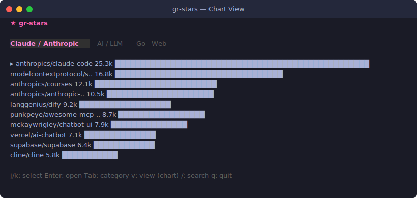
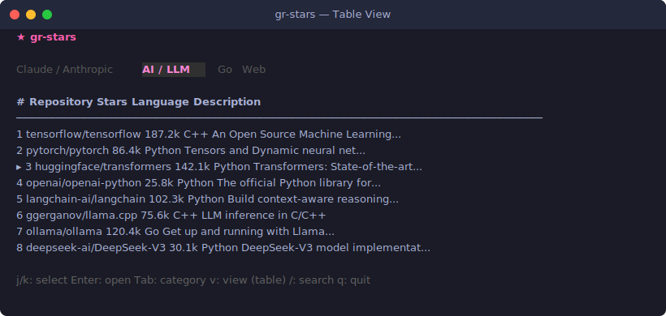

# ★ gr-stars

A CLI tool to visualize popular GitHub repositories in your terminal.
Supports category filters, chart/table view toggle, and opening repos directly in your browser.

**[日本語](README.ja.md)** | **[中文](README.zh.md)**

<p align="center">
  
</p>

<p align="center">
  
</p>

## Features

- **Bar Chart View** — Compare star counts with color-coded bars at a glance
- **Table View** — List repositories with name, stars, language, and description
- **Category Filters** — Switch between Claude/Anthropic, AI/LLM, Go, Web, and more
- **Custom Search** — Enter any GitHub search query with the `/` key
- **Browser Open** — Press Enter to open the selected repository in your browser
- **Cross-Platform** — Works on macOS, Linux, and Windows

## Installation

```bash
go install github.com/engineer-fumi/gr-stars@latest
```

Or build from source:

```bash
git clone https://github.com/engineer-fumi/gr-stars.git
cd gr-stars
go build -o gr-stars .
```

## Usage

```bash
# Start with default category (Claude / Anthropic)
gr-stars

# Start with a custom search query
gr-stars -query "topic:rust stars:>5000"
```

### GitHub Token (Recommended)

Set a Personal Access Token to avoid GitHub API rate limits:

```bash
export GITHUB_TOKEN="ghp_your_token_here"
```

> The tool works without a token, but you may hit rate limits with frequent requests.

## Keybindings

| Key | Action |
|-----|--------|
| `j` / `↓` | Select next repository |
| `k` / `↑` | Select previous repository |
| `Enter` | Open selected repository in browser |
| `Tab` | Switch to next category |
| `Shift+Tab` | Switch to previous category |
| `v` | Toggle chart ⇄ table view |
| `/` | Enter custom search mode |
| `Esc` | Exit search mode |
| `q` | Quit |

## Categories

| Category | Query |
|----------|-------|
| Claude / Anthropic | `claude OR anthropic OR mcp-server topic:claude` |
| AI / LLM | `llm OR ai OR gpt topic:machine-learning` |
| Go | `language:go stars:>1000` |
| Web | `topic:react OR topic:vue OR topic:nextjs` |

## Tech Stack

- [Go](https://go.dev/)
- [Bubble Tea](https://github.com/charmbracelet/bubbletea) — TUI framework
- [Lip Gloss](https://github.com/charmbracelet/lipgloss) — Terminal styling
- [GitHub Search API](https://docs.github.com/en/rest/search/search) — Repository search

## License

[MIT](LICENSE)
